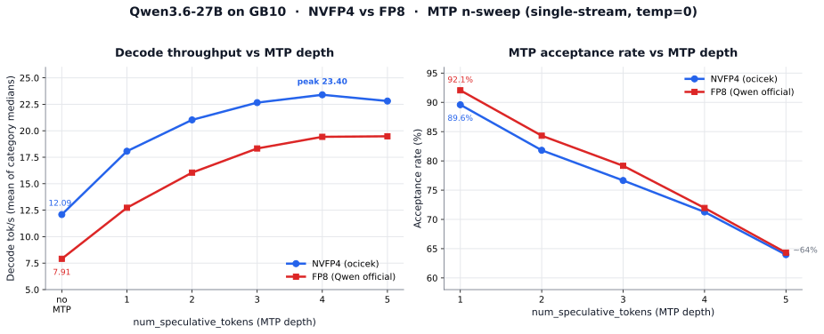

# gb10-qwen3.6-27b

Benchmarking dense Qwen3.6-27B on GB10: does the ocicek NVFP4 checkpoint's MTP head survive quantization, and how does NVFP4 compare to FP8 across speculative-decoding depth?

> ✅ **Status: Complete (v1).** 12 experiments run — NVFP4 and FP8, each swept across no-MTP and MTP n=1–5. Headline result, full comparison, and verdict below.

## TL;DR

The ocicek `Qwen3.6-27B-NVFP4` MTP head is **healthy: 89.59% acceptance at n=1**, versus the 0.04% the sibling 35B project measured on unsloth's broken-MTP checkpoint. Speculative decoding lifts NVFP4 throughput from a 12.09 tok/s baseline to a **23.40 tok/s peak at n=4 (1.94×)**. NVFP4 beats Qwen's official FP8 at every depth — 1.53× at baseline, narrowing to ~1.20× at n=4 — and acceptance turns out to be a property of the MTP head, nearly identical across both quant formats. **Recommended config: NVFP4, MTP n=4.** To our knowledge this is the first published NVFP4-vs-FP8 × MTP-depth sweep for dense Qwen3.6-27B on GB10.

## Methodology

This project follows the shared methodology defined in the [top-level README](../README.md#methodology): pinned image digests, acceptance rate empirically measured via `/metrics` scrape, deterministic benchmarks (temp=0, 5 categories × 5 runs + 2 warmup, `max_tokens=500`), and self-contained per-experiment folders. The MTP-acceptance discipline is inherited directly from the 35B project, which uncovered that vLLM reports MTP as "working" when the drafter is producing noise.

## Why this model: Qwen3.6-27B-NVFP4

The primary checkpoint is [`ocicek/Qwen3.6-27B-NVFP4`](https://huggingface.co/ocicek/Qwen3.6-27B-NVFP4); the FP8 comparison arm uses Qwen's official `Qwen/Qwen3.6-27B-FP8`.

- **Strongest open-weights model in its size class.** Qwen3.6-27B scores 46 on the Artificial Analysis Intelligence Index v4.0, versus a median of 15 for open-weights models of similar size. Artificial Analysis described it as the new open-weights leader under 150B parameters at release.
- **Fits GB10 with substantial headroom.** ~13.5 GB resident weight footprint at NVFP4. With KV cache and CUDA graph overhead, the working set is well under half of GB10's 128 GB unified memory, leaving room for co-resident models.
- **Dense, not MoE.** Simpler performance surface than the 35B-A3B work in this repo. No shared-expert handling, no MoE kernel fallback risk.
- **Vision tower preserved (BF16).** Multimodal capability without a separate model.
- **MTP head preserved (BF16) per the model card.** This is the central test of this project: the 35B work found that unsloth's NVFP4 quantization silently broke the MTP head (0.04% acceptance, 32–54% throughput regression). The ocicek checkpoint explicitly preserves the MTP head in BF16. Does that translate to working speculative decoding in practice? E02–E06 measure it. **Verdict: yes.**
- **Quantized on DGX Spark GB10 with `sm_121a`.** The author targeted this exact hardware. It's about as well-fitted as a public NVFP4 checkpoint gets.

## Why this image: vLLM `cu130-nightly`

- **SM 12.1 (`sm_121a`) support is in the cu130 line.** Earlier cu128 images predate proper Blackwell-consumer support. cu130 is where the relevant kernels actually live.
- **Matches the 35B project in this repo.** Same image stack across both projects keeps cross-project comparisons apples-to-apples.
- **Matches stevescargall's published RedHatAI 35B-A3B-NVFP4 GB10 benchmark.** Same image as the closest peer-published result, for the same reason.
- **Pinned by sha256 digest.** The `cu130-nightly` tag identifier is informational; the digest is the contract. The exact digest used is captured in every per-experiment folder's `boot_meta.json` (`sha256:3dbe092ec5b2cef63b6104d33fa75d6ce53a7870962529ada69f78bbbc38e776`, vLLM `0.19.2rc1.dev134+gfe9c3d6c5`).

**Pre-integration floor.** NVIDIA's April 2026 NVFP4 perf update announced that FlashInfer 0.6.8 and Luke Alonso's SM 120/121-optimized MoE and GEMM kernels are landing in vLLM imminently. The numbers in this project represent performance *before* those kernels integrate. Treat these results as the conservative baseline; expect upstream improvements to raise the floor in subsequent releases.

## Experiment matrix

Two quantization formats, each swept across the same speculative-decoding depth. Everything else within a format (prefix caching, prompts, token budget, image digest) is held constant; see Caveats for the controls that differ between the NVFP4 and FP8 arms.

### NVFP4 arm — `ocicek/Qwen3.6-27B-NVFP4`

| ID | Config | Decode tok/s | Acceptance | Status |
|---|---|---:|---:|---|
| E01 | No speculative decoding | 12.09 | — | PASS |
| E02 | MTP `n=1` | 18.07 | 89.59% | PASS |
| E03 | MTP `n=2` | 21.03 | 81.81% | PASS |
| E04 | MTP `n=3` | 22.66 | 76.65% | PASS |
| E05 | MTP `n=4` | **23.40** | 71.27% | PASS |
| E06 | MTP `n=5` | 22.81 | 63.97% | PASS |

### FP8 arm — `Qwen/Qwen3.6-27B-FP8`

| ID | Config | Decode tok/s | Acceptance | Status |
|---|---|---:|---:|---|
| E07 | No speculative decoding | 7.91 | — | PASS |
| E08 | MTP `n=1` | 12.73 | 92.06% | PASS |
| E09 | MTP `n=2` | 16.05 | 84.30% | PASS |
| E10 | MTP `n=3` | 18.33 | 79.16% | PASS |
| E11 | MTP `n=4` | 19.43 | 71.95% | PASS |
| E12 | MTP `n=5` | 19.48 | 64.32% | PASS |

Throughput is the mean of per-category medians. Acceptance is computed from `/metrics` spec-decode counter deltas across the benchmark window.

## Results



**1. MTP works, and it is worth turning on.** Speculative decoding lifts NVFP4 from a 12.09 tok/s baseline to a 23.40 tok/s peak — a **1.94× speedup** — and FP8 from 7.91 to 19.48, a **2.46× speedup**. On a bandwidth-bound dense model, MTP is the single most effective lever available without changing the container or the kernels. The central question the project was designed to answer is settled: 89.59% acceptance at n=1 means the ocicek checkpoint's preserved MTP head is genuinely functional — the mirror image of the 35B project's broken-MTP finding.

**2. NVFP4 beats FP8 at every depth.** The gap is 1.53× at the no-MTP baseline (12.09 vs 7.91) and narrows to ~1.20× by n=4 (23.40 vs 19.43). MTP partially compensates for FP8's larger per-token weight read, but never closes the gap. For this model on this hardware, NVFP4 is strictly the better deployment format — the advantage of reading ~7 GB/token instead of ~27 GB/token persists across the entire sweep.

**3. Acceptance is governed by the MTP head, not the quant format.** The two acceptance curves are nearly coincident: 89.6 / 81.8 / 76.7 / 71.3 / 64.0 (NVFP4) against 92.1 / 84.3 / 79.2 / 72.0 / 64.3 (FP8). FP8 accepts 2–3 points higher at low n — its weights sit closer to the original distribution, so the head drafts marginally better — but the curves converge by n=5. Acceptance is a property of the single MTP layer applied recursively; the recursion depth drives the monotonic decline, and the weight quantization format is second-order.

**4. The throughput optimum is format-dependent.** NVFP4 peaks at **n=4** (23.40) and regresses at n=5. FP8 is still flat-to-rising at n=5 (19.43 → 19.48), so its optimum is n=5 or just beyond. The mechanism: FP8's slower base decode makes each accepted token worth more relative to the fixed per-step cost of running the MTP head, so FP8 tolerates deeper speculation before rejection overhead dominates. NVFP4's faster base decode reaches that crossover one step sooner. **Recommended setting: NVFP4 at n=4.**

### Bandwidth reconciliation

The no-MTP baselines let us back out GB10's effective decode bandwidth. FP8 reads ~27 GB of weights per token at 7.91 tok/s, implying **~214 GB/s effective** — about 78% of the 273 GB/s nominal, a normal real-world efficiency. Re-deriving the NVFP4 ceiling at that effective bandwidth (~7 GB/token) gives a no-MTP-equivalent bound near 30 tok/s. The measured NVFP4 peak of 23.40 tok/s at n=4 therefore leaves roughly 20–30% on the table — headroom the DFlash speculative path (dedicated drafter, higher k) is what claims, per AEON-7's published ~32 tok/s median on the same silicon. MTP with a single recursive head has a genuinely lower ceiling than a dedicated drafter; that is the next experiment, not a defect in this one.

## Directory structure

```
gb10-qwen3.6-27b/
├── README.md                       # This file
├── mtp_sweep.svg                   # Throughput + acceptance chart (NVFP4 vs FP8)
├── benchmark.sh                    # Shared benchmark driver, copied from 35B repo
├── run_all_experiments.sh          # Overnight orchestrator
├── run_all_experiments.log         # Top-level orchestration trace
├── E01_no_mtp/                     # NVFP4, baseline, no speculative decoding
│   ├── run_vllm.sh                 # Docker run script for this experiment
│   ├── boot.log                    # Full container startup log
│   ├── boot_meta.json              # Machine-readable run provenance
│   ├── benchmark_result.txt        # Raw benchmark output (human-readable)
│   ├── benchmark_result.json       # Same data, machine-parseable
│   ├── metrics_start.txt           # Full /metrics dump before bench
│   ├── metrics_end.txt             # Full /metrics dump after bench
│   └── README.md                   # Per-experiment digest and verdict
├── E02_mtp1/ … E06_mtp5/           # NVFP4, num_speculative_tokens = 1…5
└── E07_fp8_quant_nomtp/ … E12_fp8_quant_mtp5/   # FP8, baseline then n = 1…5
```

All experiment folders mirror E01's internal file structure exactly.

### Per-file details

**`benchmark.sh`** — Shared benchmark driver, copied from `gb10-qwen3.6-35b-a3b/mtp-speculative/bench.sh`. Streaming OpenAI client, 5 prompt categories × 5 runs + 2 warmup, temp=0, `max_tokens=500`. Scrapes `/metrics` at start and end for spec-decode counters (`vllm:spec_decode_num_drafts_total`, `num_draft_tokens_total`, `num_accepted_tokens_total`) and computes acceptance rate. Same script invoked by every experiment to guarantee apples-to-apples comparison.

**`run_all_experiments.sh`** — Overnight orchestrator. For each experiment in order: tears down any existing container, sanity-checks GPU state, launches `run_vllm.sh`, polls `/health` with a 5-minute timeout, captures boot log and provenance metadata, snapshots `/metrics` before the bench, runs `benchmark.sh`, snapshots `/metrics` after, parses the txt into json, generates the per-experiment README stub, tears down the container, and sleeps for memory release. Crash-isolated so one experiment's failure doesn't stop the rest.

**`E*/run_vllm.sh`** — Self-contained docker run script for one experiment. Pinned image digest, all flags inline, no external dependencies. The only differences across scripts are the model (NVFP4 vs FP8 arm) and the `--speculative-config` flag (absent for the no-MTP runs, present with `n=1…5` otherwise).

**`E*/boot.log`** — Full `docker logs` output from container start through "Application startup complete." Used to verify kernel selection (`FlashInferCutlassNvFp4LinearKernel` vs Marlin fallback), KV cache size, max concurrency, MTP head load status, CUDA graph mode, and warnings.

**`E*/boot_meta.json`** — Machine-readable provenance: `image_ref`, `image_digest_sha256`, `container_id`, start/ready timestamps, boot duration, hostname, GPU name, driver version, CUDA version, vLLM version, host free memory at launch.

**`E*/benchmark_result.{txt,json}`** — Raw and parsed bench output: per-prompt per-run `ttft_ms`, `tpot_ms`, `decode_t/s`, `total_t/s`, `tokens`, with median and p95 rows, plus spec-decode counter deltas and acceptance rate.

**`E*/metrics_{start,end}.txt`** — Full Prometheus `/metrics` dumps before and after the benchmark. Diff captures every counter (KV hit rate, queue depth, scheduler iteration time), not just the spec-decode subset.

## How to reproduce

Clone the repo, pull the pinned image digest, and run `./run_all_experiments.sh` from `gb10-qwen3.6-27b/`. Expected total runtime is several hours for all 12 experiments including teardown and warmup. Each experiment is crash-isolated; results land in the corresponding `E*/` folder.

## Caveats and open items

- **FP8 arm controls differ from the NVFP4 arm.** `max_num_seqs` was 2 for the NVFP4 runs (and E07) but 1 for E08–E12; `max_model_len` was 128K for NVFP4, 8K for E07, and 32K for E08–E12. At single-stream these are largely second-order and far smaller than the measured format gap, but they are uncontrolled variables. A v2 should re-run the FP8 arm at the NVFP4 arm's exact settings.
- **FP8 `long_context` underperforms.** FP8 long_context lands at 14–15 tok/s while code_gen reaches ~22 — a wider intra-format spread than NVFP4 shows, consistent with the reduced context limit interacting with the long_context prompt. The mean-of-medians masks it; see per-experiment tables.
- **PIECEWISE CUDA graph mode.** FlashInfer + speculative decoding forces `CUDAGraphMode=PIECEWISE`; FULL graphs are unsupported in this combination. This costs throughput; the size of the cost vs FULL is not isolated in v1.
- **compressed-tensors NVFP4 split q/k/v scale warning.** Observed at load time. The warning notes "reduced accuracy"; no MoE here, so no shared-expert pathway is affected.
- **Qwen3.6 has only 1 MTP layer.** vLLM applies this single layer recursively for `n>1`. The monotonic acceptance decline across the n-sweep confirms that recursion, not the head itself, is the limiting factor.
- **MTP ceiling vs DFlash.** A single recursively-applied MTP head tops out near 23 tok/s for NVFP4 here. Closing the gap to the ~30 tok/s bandwidth bound (and matching AEON-7's ~32 median) requires a dedicated drafter via DFlash — a natural v2.
- **Imminent upstream improvements.** FlashInfer 0.6.8 and Luke Alonso's SM 120/121 kernels are landing in vLLM per NVIDIA's April 2026 perf update. These numbers represent the pre-integration floor.

## Comparison with published GB10 benchmarks

- **AEON-7 — Qwen3.6-27B abliterated, DFlash on GB10.** Reports ~32.1 tok/s median / 56.2 peak single-stream using a dedicated DFlash drafter at k=15 on a patched `sm_121a` container. Different speculative method (dedicated drafter vs in-model MTP head) and an abliterated checkpoint, so not a like-for-like comparison — but it establishes the practical ceiling this project's MTP path falls short of, and motivates the DFlash v2.
- *rikkarth — Qwen3.6-35B-A3B FP8 on GB10*
- *stevescargall — RedHatAI Qwen3.6-35B-A3B-NVFP4 on GB10*
- *ai-muninn — Qwen3.5-35B on GB10*
- *adadrag — Qwen3.5-35B GB10 guide*

To our knowledge, this is the first published systematic **NVFP4-vs-FP8 × MTP-depth** sweep for dense Qwen3.6-27B on GB10 with both vision and MTP preserved per the model card.

## What we chose not to vary (v1 scope)

- **Self-quantization with ModelOpt or similar.** Calibration dataset choice, per-tensor vs per-channel scales, vision tower handling, and MTP head handling are all non-trivial. The 35B MTP finding is the cautionary tale: unsloth's quantization silently broke the MTP head. We'd rather measure ocicek's published artifact first and establish what "works" looks like before generating our own.
- **DFlash / dedicated-drafter speculative decoding.** The bandwidth analysis and the AEON-7 comparison both point to DFlash as the path past the MTP ceiling. It is the headline v2 experiment, deliberately out of v1 scope.
- **Container image sweep.** Alternative images exist (eugr's source-built community image with fastsafetensors, NGC's `nvcr.io/nvidia/vllm`, AEON-7's patched build). A sanity check on eugr is a reasonable v2 addition.
- **Alternative NVFP4 checkpoints.** Other quants of Qwen3.6-27B exist (sakamakismile, mmangkad). A "which 27B-NVFP4 is best on GB10" comparison is an optional follow-up.

## Related work in this repo

The sibling project [`gb10-qwen3.6-35b-a3b/`](../gb10-qwen3.6-35b-a3b/README.md) benchmarks `unsloth/Qwen3.6-35B-A3B-NVFP4` on the same hardware. Its [`mtp-speculative/`](../gb10-qwen3.6-35b-a3b/mtp-speculative/README.md) subfolder closed out the MTP question for that checkpoint with a specific finding: unsloth's NVFP4 quantization broke the MTP head (0.04% acceptance), causing MTP `n=1/2/3` to monotonically degrade throughput by 32–54%. That finding directly motivated this work — and the answer here is the opposite: ocicek's preserved-MTP-in-BF16 checkpoint yields 89.59% acceptance at n=1. Same test, opposite outcome, and the difference is entirely in the quantization recipe.

## Acknowledgements

- [ocicek](https://huggingface.co/ocicek) for the `Qwen3.6-27B-NVFP4` checkpoint with vision and MTP preserved
- The Qwen team for the open-weights model and the official FP8 checkpoint
- The vLLM project and NVIDIA for the NVFP4 kernel work landing in cu130
- Prior GB10 benchmarkers — rikkarth, stevescargall, AEON-7, ai-muninn, adadrag — whose published work establishes the comparison baseline
