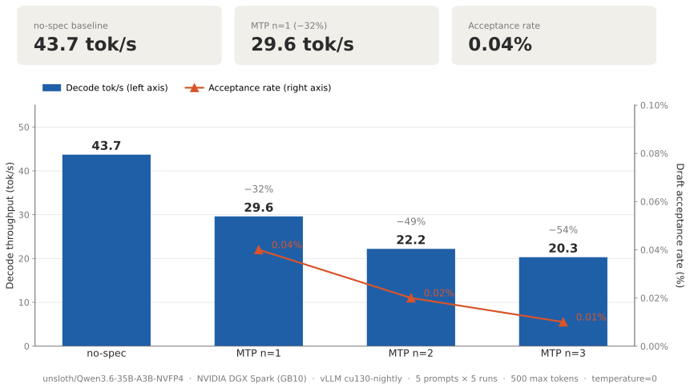

# Qwen3.6-35B-A3B-NVFP4 on NVIDIA DGX Spark (GB10)

First documented working configuration of `unsloth/Qwen3.6-35B-A3B-NVFP4`
on an ASUS Ascent GX10 / NVIDIA GB10, with reproducible Docker setup
and measured throughput.

## TL;DR

- **44.5 ± 0.1 tok/s** single-stream (n=3, deterministic)
- **81.0 tok/s** aggregate at concurrency 2 (1.82× scaling, 91% efficiency)
- **21.5 GB** resident memory — leaves ~100 GB free for co-residency
- **vllm/vllm-openai:cu130-nightly** image, no patches
- **Marlin (linear) + CUTLASS (MoE) NVFP4 path** on SM 12.1 — see [kernel selection](#what-the-kernel-selection-actually-picked)

## Why NVFP4 on GB10 (and what it really means)

GB10 is **not** a native FP4 chip. True FP4 tensor cores (`tcgen05` / UTCQMMA)
live on data-center Blackwell (B100/B200, SM 10.0). On GB10's SM 12.1, the
validated NVFP4 path is **weight-only FP4 compression**: weights are stored as
FP4 and dequantized to BF16 at the GEMM kernel. The benefit is reduced memory
bandwidth per token, not faster compute.

This still matters because GB10 is bandwidth-bound:
- 128 GB unified memory at ~273 GB/s
- Dense 27B at FP8 reads ~27 GB per token's worth of weights
- MoE 35B-A3B at NVFP4 reads ~3 GB of *active* expert weights per token

The MoE + NVFP4 combination compounds the bandwidth win, which is why it
outperforms the dense FP8 alternative on this hardware despite the smaller
nominal FLOPs gap.

> **Measured confirmation.** This bandwidth model is no longer just theory.
> The sibling [27B project](../gb10-qwen3.6-27b/README.md) later measured dense
> FP8 directly at **7.91 tok/s** with no speculative decoding — implying ~214 GB/s
> effective bandwidth (~78% of the 273 GB/s nominal), and confirming that decode
> on this hardware is bandwidth-bound exactly as the per-token weight-read
> arithmetic predicts.

## Running it

### Prerequisites
- Docker with NVIDIA Container Toolkit
- ~25 GB free disk for the model weights
- A free port (we use 8000 below)

### Pre-download weights

```bash
export HF_HUB_ENABLE_HF_TRANSFER=0   # more reliable than the fast downloader
huggingface-cli download unsloth/Qwen3.6-35B-A3B-NVFP4 --resume-download
```

### Pull the exact image

```bash
docker pull vllm/vllm-openai@sha256:3dbe092ec5b2cef63b6104d33fa75d6ce53a7870962529ada69f78bbbc38e776
```

(The tag `vllm/vllm-openai:cu130-nightly` is mutable; the digest above
is what was tested.)

### Launch

```bash
docker run -d --name vllm-qwen36-35b \
  --cpuset-cpus="10-19" --gpus all --network=host --ipc=host \
  --ulimit memlock=-1:-1 --ulimit stack=67108864:67108864 \
  -e PYTORCH_CUDA_ALLOC_CONF="expandable_segments:True" \
  -e VLLM_NVFP4_GEMM_BACKEND=marlin \
  -e VLLM_USE_FLASHINFER_MOE_FP4=0 \
  -e VLLM_USE_FLASHINFER_SAMPLER=1 \
  -e VLLM_ALLOW_LONG_MAX_MODEL_LEN=1 \
  -e VLLM_FLASHINFER_MOE_BACKEND=latency \
  -e VLLM_MARLIN_USE_ATOMIC_ADD=1 \
  -e HF_HOME=/root/.cache/huggingface \
  -e TOKENIZERS_PARALLELISM=false \
  -v $HOME/.cache/huggingface:/root/.cache/huggingface \
  -v $HOME/.cache/vllm:/root/.cache/vllm \
  -v $HOME/.cache/torch:/root/.cache/torch \
  vllm/vllm-openai:cu130-nightly \
    unsloth/Qwen3.6-35B-A3B-NVFP4 \
    --served-model-name qwen3.6-35b-a3b \
    --host 0.0.0.0 --port 8000 \
    --max-model-len 32768 \
    --max-num-seqs 2 \
    --max-num-batched-tokens 8192 \
    --gpu-memory-utilization 0.25 \
    --kv-cache-dtype fp8_e4m3 \
    --mamba-ssm-cache-dtype float16 \
    --mamba-cache-dtype float16 \
    --enable-chunked-prefill \
    --enable-prefix-caching \
    --reasoning-parser qwen3 \
    --enable-auto-tool-choice \
    --tool-call-parser qwen3_coder \
    --generation-config vllm \
    --max-cudagraph-capture-size 256 \
    --trust-remote-code
```

First boot takes ~4 minutes (weights load ~150s, compile ~30s, warmup ~45s,
CUDA graph capture ~4s). Subsequent boots with the same config and mounted
cache directories drop torch.compile to under 5 seconds.

## Verification

```bash
curl -s http://localhost:8000/v1/chat/completions \
  -H 'Content-Type: application/json' \
  -d '{
    "model":"qwen3.6-35b-a3b",
    "messages":[{"role":"user","content":"Say hi in one word."}],
    "max_tokens":30,
    "temperature":0,
    "chat_template_kwargs":{"enable_thinking":false}
  }'
```

Expected: a one-word response with `finish_reason: "stop"`.

## Measured performance

### Single-stream throughput (concurrency = 1)

Three runs of identical workload (200-word technical essay, max 300 tokens,
temperature=0, thinking disabled):

| Run | Output tokens | Wall-clock | tok/s |
|----:|--------------:|-----------:|------:|
| 1   | 300           | 6.732 s    | 44.6  |
| 2   | 296           | 6.648 s    | 44.5  |
| 3   | 300           | 6.745 s    | 44.5  |

**Mean: 44.5 ± 0.1 tok/s** (std dev 0.06 across n=3). Variance under 0.2%.

### Concurrency = 2

Two requests sent in parallel, identical prompt structure:

| Stream | Output tokens | Wall-clock | Per-stream tok/s |
|--------|--------------:|-----------:|-----------------:|
| R1     | 298           | 6.35 s     | 46.9             |
| R2     | 269           | 7.00 s     | 38.4             |
| **Aggregate** | **567** | **7.00 s** | **81.0**       |

**Scaling efficiency: 1.82× (91%)** from c=1 (44.5) to c=2 (81.0).
Per-stream slowdown under contention: ~4%. The workload remains
bandwidth-bound rather than scheduler-bound at this concurrency.

### Memory footprint

```
Model loading took 21.52 GiB memory
GPU KV cache size: 116,848 tokens
Maximum concurrency for 32,768 tokens per request: 11.78x
```

## What the kernel selection actually picked

From boot logs:

```
Using MarlinNvFp4LinearKernel for NVFP4 GEMM
Using Triton/FLA GDN prefill kernel
Using 'VLLM_CUTLASS' NvFp4 MoE backend
Using FLASHINFER attention backend
Using FlashInfer for top-p & top-k sampling
```

**This is the most important nuance in the whole writeup, and it's easy to
get wrong.** Three different NVFP4 kernels are in play, and for an MoE model
the one that matters most for throughput is *not* Marlin:

| Path | Kernel selected | Controls |
|------|-----------------|----------|
| Linear layers (attn proj, etc.) | `MarlinNvFp4LinearKernel` | `VLLM_NVFP4_GEMM_BACKEND=marlin` |
| **MoE expert GEMMs** | **`VLLM_CUTLASS` NvFp4 MoE backend** | independent — *not* set by the GEMM backend env var |
| GatedDeltaNet prefill | `Triton/FLA GDN` kernel | — |

Because 35B-A3B is a mixture-of-experts model, the bulk of the decode work
runs through the **expert GEMMs on the CUTLASS path**, not the Marlin linear
path. Setting `VLLM_NVFP4_GEMM_BACKEND=marlin` controls only the linear-layer
kernel; the MoE kernel selection is made independently and chose CUTLASS on
this hardware. If you're tuning your own deployment, this is the distinction
to internalize — chasing the Marlin path alone would be optimizing the wrong
kernel.

The expected warning *"Your GPU does not have native support for FP4
computation"* is correct and not a problem — it's the weight-only dequant
path explaining itself.

## Reproducibility

### Image (immutable digest)

```
vllm/vllm-openai@sha256:3dbe092ec5b2cef63b6104d33fa75d6ce53a7870962529ada69f78bbbc38e776
```

Tag at time of test: `vllm/vllm-openai:cu130-nightly`
Local image ID: `sha256:ffa30d66ff5c9346c6389507cc529827fc9934a6d2ee37855934f94fe1061cdc`

**Use the digest, not the tag.** `cu130-nightly` is mutable.

### Software stack (inside container)

| Component             | Version                                |
|-----------------------|----------------------------------------|
| vLLM                  | `0.19.2rc1.dev134+gfe9c3d6c5.cu130`    |
| vLLM git commit       | `fe9c3d6c5`                            |
| PyTorch               | `2.11.0+cu130`                         |
| FlashInfer            | `0.6.8.post1`                          |
| Transformers          | `5.6.0`                                |
| CUDA (PyTorch-linked) | 13.0                                   |
| CUDA toolkit (nvcc)   | `cuda_13.0.r13.0` build `36424714_0`   |
| Python                | 3.12                                   |

### Host stack

| Component                  | Version                            |
|----------------------------|------------------------------------|
| OS                         | Ubuntu 24.04.3 LTS (noble)         |
| Kernel                     | 6.14.0-1015-nvidia (aarch64)       |
| Architecture               | aarch64                            |
| NVIDIA driver              | 580.95.05                          |
| CUDA (system)              | 13.0                               |
| Docker                     | 28.5.1 (build e180ab8)             |
| Container runtime          | nvidia + runc                      |
| NVIDIA Container Toolkit   | 1.18.1 (build 889a3bb, 2025-11-24) |
| Storage driver             | overlay2                           |

**Driver requirement:** SM 12.1 NVFP4 kernel routing was added in vLLM
PRs #37725 and #38126, and requires a recent driver. This benchmark used
driver 580.95.05; earlier drivers may not route correctly.

### Hardware

| Component         | Spec                                                 |
|-------------------|------------------------------------------------------|
| Workstation       | ASUS Ascent GX10                                     |
| GPU               | NVIDIA GB10 (Blackwell, compute capability 12.1)     |
| GPU memory        | 128 GB unified LPDDR5X (~273 GB/s)                   |
| CPU               | ARM Cortex-X925 + Cortex-A725 hybrid, 20 cores       |
| CPU vendor        | ARM                                                  |
| System memory     | 119.6 GiB (unified with GPU)                         |
| NUMA              | Single node (node0: CPUs 0–19)                       |
| Disk filesystem   | EXT4                                                 |

The CPU is ARM aarch64, not x86. The `vllm/vllm-openai:cu130-nightly`
image ships multi-arch manifests so the same tag resolves correctly
on aarch64.

## Comparison with published numbers (same hardware class)

**These numbers are not directly comparable** — architecture and speculative
method differ across every row. Read down a single group, not across groups.

### 35B-A3B MoE (~3B active params/token)

| Configuration                                    | tok/s          | Spec method | Source                   |
|--------------------------------------------------|---------------:|-------------|--------------------------|
| **unsloth/Qwen3.6-35B-A3B-NVFP4 (this repo)**    | **44.5 ± 0.1** | none        | **This repo**            |
| RedHatAI/Qwen3.6-35B-A3B-NVFP4                    | 55.9           | MTP         | Steve Scargall, Apr 2026 |
| RedHatAI/Qwen3.6-35B-A3B-NVFP4 (warmup)          | 53.1           | MTP         | Same                     |

The ~11 tok/s gap to Scargall is the headline optimization target — but note
it's confounded: it's a **different checkpoint** (RedHatAI vs unsloth) *and*
a different speculative config (MTP vs none). Given this repo's MTP finding
(below), the gap is likely driven as much by MTP-head quality across the two
checkpoints as by the on/off of speculative decoding itself.

### 27B dense (all params/token) — different architecture, for context only

| Configuration                          | tok/s             | Spec method | Source             |
|-----------------------------------------|------------------:|-------------|--------------------|
| AEON-7 27B dense NVFP4                  | 32 median / 56 pk | DFlash      | AEON-7 README      |
| Sibling 27B project, ocicek NVFP4       | 23.4              | MTP n=4     | [27B project](../gb10-qwen3.6-27b/README.md) |

Included only to forestall a common confusion: dense 27B is a *heavier*
per-token read than 35B-A3B MoE (all params vs ~3B active), so its ceiling is
lower despite the smaller parameter count. A dense-27B "44 tok/s" is not on
the table on this hardware; see the 27B project for the bandwidth analysis.

## MTP / speculative decoding: resolved

The original open question here — *does unsloth's NVFP4 checkpoint include a
working MTP head?* — has been answered, and the answer is **no**.



Testing MTP on this checkpoint produced **0.04% acceptance** and a **32–54%
throughput regression** across `n=1/2/3`: vLLM loaded and reported MTP as
active, but the drafter was producing noise, so every speculative step cost
compute without yielding accepted tokens. The chart above tells the whole
story — throughput collapses from a 43.7 tok/s no-spec baseline to 20.3 at
n=3 (−54%), while the acceptance line never lifts off the floor (0.04% →
0.02% → 0.01%). Speculative decoding is supposed to *raise* throughput; here
it does the opposite, which is the signature of a broken draft head.

> **On the two baselines.** The chart's 43.7 tok/s no-spec figure comes from
> the MTP harness (5 prompts × 5 runs, 500 tokens, temp=0) so it is
> apples-to-apples with the MTP bars. It differs slightly from the headline
> **44.5 ± 0.1** above, which was measured separately on the 3-run, 300-token
> essay workload. Both are valid; they're just different benchmarks. This is the cautionary finding that
motivated the sibling 27B project, which asked the same question of a checkpoint
([`ocicek/Qwen3.6-27B-NVFP4`](https://huggingface.co/ocicek/Qwen3.6-27B-NVFP4))
that explicitly preserves the MTP head in BF16 — and there the answer was the
opposite: **89.59% acceptance at n=1**, a healthy head. Same test, two
checkpoints, opposite outcomes, and the difference is entirely in the
quantization recipe.

The lesson, inherited as standing methodology across this repo: **never trust
vLLM's "MTP enabled" log line.** Always measure acceptance empirically via
`/metrics` (`vllm:spec_decode_num_drafts_total`, `num_draft_tokens_total`,
`num_accepted_tokens_total`).

## Caveats and open items

- **Quality not formally evaluated.** Manual smoke testing shows coherent
  output, but no MMLU/GSM8K/HumanEval results yet.
- **Concurrency curve not characterized beyond c=2.** Higher concurrency
  benchmarks pending.
- **MTP is a dead end on this checkpoint.** Closing the gap to Scargall's
  ~56 tok/s requires either the RedHatAI checkpoint (working MTP head) or a
  dedicated-drafter method like DFlash. The unsloth checkpoint + MTP path is
  confirmed not viable.

## Acknowledgements

- Unsloth team for the NVFP4 quantization
- Qwen team for the base model
- vLLM team for the upstream cu130-nightly image with SM 12.1 fixes
  (PRs #37725, #38126)
- Steve Scargall and AEON-7 for the reference benchmark numbers

## License

This benchmark write-up: MIT. Model weights, vLLM, and the images they
contain are governed by their respective upstream licenses.
